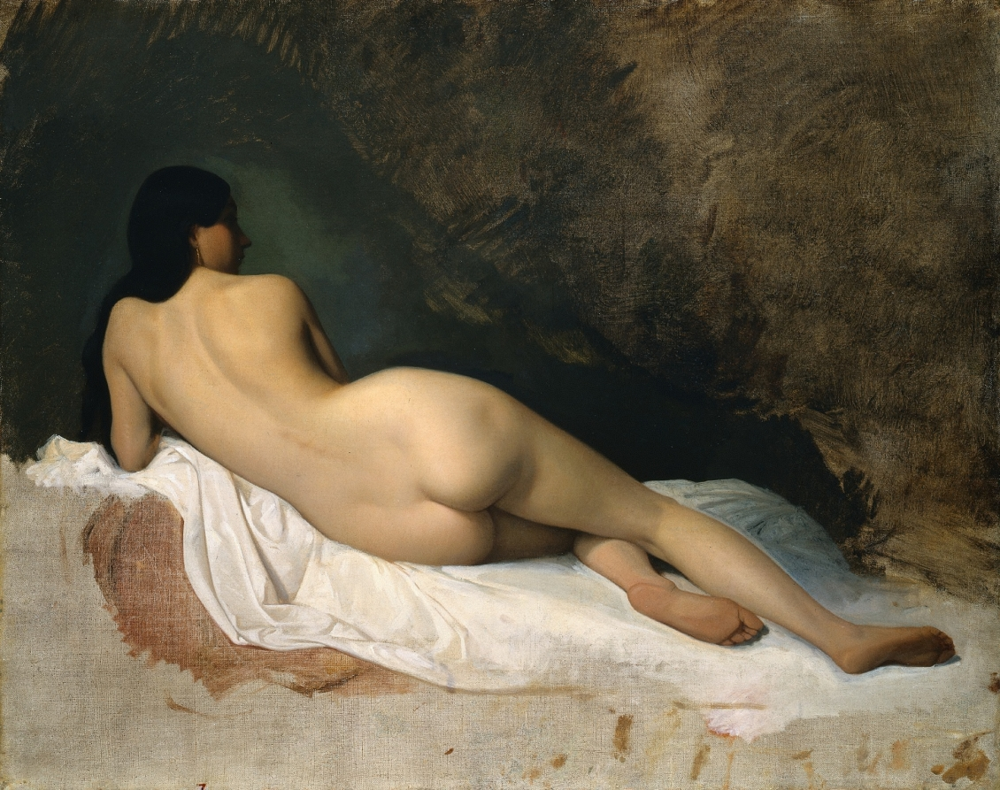

# Public Art Scanner

## Background

The aim of this project is to retrieve tagged art globally and provide a wider scope for nude art. The PAS is a work-in-progress. At the moment, this project showcases images from the Cleveland Art Museum (https://clevelandart.org/)

## Tools Used

  1. Jupyter Notebook
  2. Python
  3. Pandas
  4. Leaflet.js (coming soon)
  5. Flask (coming soon)
